# 👋 Hi, I'm Suman Sarkar

### Data Scientist | Machine Learning | GenAI | Data & AI Engineering

I build **data-driven products, machine learning solutions, and AI applications** with a focus on turning complex data into practical business outcomes.

Currently exploring and building with **Generative AI, LLM applications, MLOps, cloud platforms, and modern data engineering architectures**.

---

## 🚀 What I Work On

* 🤖 Machine Learning & Predictive Modeling
* 🧠 Generative AI & LLM Applications
* 🔗 RAG, AI Agents & LLM Orchestration
* 📊 Data Science & Advanced Analytics
* 🏗️ Data Engineering & Data Warehousing
* ☁️ Cloud & MLOps
* 👁️ Computer Vision
* 💬 Natural Language Processing
* 📈 Business Intelligence & Data Visualization

---

## 🛠️ Tech Stack

### Languages

<p>

</p>

### AI / Machine Learning

<p>

</p>

**Machine Learning:**
`Scikit-learn` · `XGBoost` · `LightGBM` · `PyTorch` · `TensorFlow`

**GenAI / LLM:**
`LLMs` · `RAG` · `LangChain` · `LangGraph` · `Prompt Engineering` · `AI Agents`

### Data & Engineering

<p>

</p>

`SQL` · `Spark` · `PySpark` · `Pandas` · `NumPy` · `Delta Lake` · `Data Warehousing`

### Cloud & MLOps

<p>

</p>

`Docker` · `Kubernetes` · `Git` · `CI/CD` · `MLOps` · `Model Deployment`

### APIs & Development

<p>

</p>

`REST APIs` · `FastAPI` · `Flask` · `Python Services`

---

## 💡 Areas of Interest

```text
Artificial Intelligence
├── Generative AI
├── Large Language Models
├── RAG Systems
├── AI Agents
└── NLP

Machine Learning
├── Predictive Modeling
├── Feature Engineering
├── Model Evaluation
└── MLOps

Data Engineering
├── Data Warehousing
├── Distributed Processing
├── Data Pipelines
└── Feature Stores

Cloud & Platform
├── Cloud Architecture
├── Containerization
├── CI/CD
└── Model Deployment
```

---

## 📌 Featured Work

I’m particularly interested in building systems around:

* **AI-powered enterprise applications**
* **LLM-based recommendation and intelligence systems**
* **Feature stores and ML platforms**
* **Data & ML pipelines**
* **Enterprise RAG and agentic workflows**
* **Scalable analytics and machine learning solutions**

---

## 📫 Connect With Me

<p>
<a href="https://www.linkedin.com/in/suman-sarkar-40b62243/">

</a>
<a href="https://leetcode.com/ssarkar4445/">

</a>
<a href="https://www.kaggle.com/ssarkar445">

</a>
<a href="mailto:ssarkar445@gmail.com">

</a>
</p>

---

## 📊 GitHub Stats

<p align="center">
  
</p>

<p align="center">
  
</p>

---

### ⭐ Building with Data → ML → AI

> Turning data into intelligence and intelligence into products.

<!--
ssarkar445/ssarkar445 is a ✨ special ✨ repository because its README.md
appears on your GitHub profile.
-->
